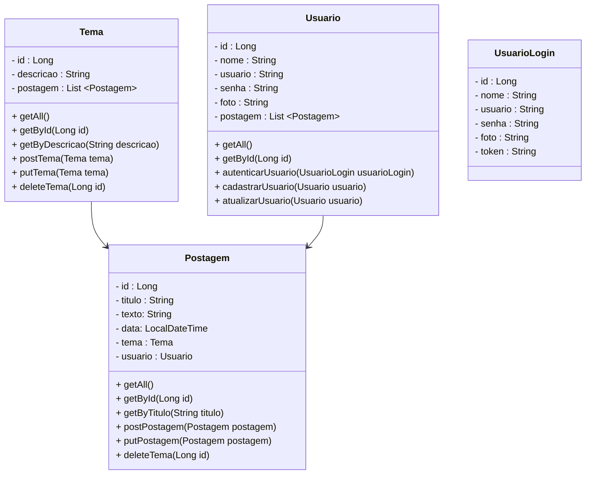

 - - 
 
 
 

  

 

*  Documentação: [Swagger](#publicacao)
* Sobre o projeto: [voltando a era dos Blogs](#sobre-projeto)
* Desenvolvimento: [trabalhando no Back-End](#desenvolvimento)
* Funcionalidades: [O que posso fazer com esta API?](#funcionalidades)
* Próximos passos: [o Front-End vem aí!](#proximos-passos)
* Sobre mim: [Oi, eu sou a Lia!](#sobre-mim)

 

## Consultas e Publicações:

 

 

##  🗨 Sobre o projeto ##

<b> Minas In Tech </b> é um Blog proposto como projeto de conclusão do Bloco II do bootcamp da Generation Brasil. Aqui aplicamos o aprendizado sobre o framework Spring e suas principais funcionalidades na criação de uma <b> API Rest em Java.</b>  Para personalizar o tema do projeto, inclui a marca do Minas In Tech como base para a criação da aplicação, de modo que pudesse em conjunto com a parte técnica, pensar em outros detalhes criativos e incluir um propósito que estivesse relacionado a mim e a minha realidade como mulher em tecnologia, por isso este blog foi pensado em transmitir assuntos relacionados a esta jornada. A ideia é um ter um espaço, parecido com um fórum, onde as usuárias pudessem incluir dúvidas reais de carreira e que outras usuárias pudessem contribuir nestas discussões, dentro de uma plataforma segura.

 

 

##  🟣 Etapas de Desenvolvimento ##
### Back-End:

- [x] Estrutura do projeto utilizando padrão MVC;
- [x] Banco de dados com MySQL;
- [x] Criação dos métodos HTTP para as operações do CRUD;
- [x] Testes de requisição da API com Insomnia;
- [x] Aplica validação de usuário com Spring Security;
- [x] Testes unitários com JUnit;
- [x] Documentação do projeto com o SpringDoc e Swagger;
- [x] Deploy da aplicação com Render;

 

 

## 🟣 Funcionalidades

| **CAMADA**|                FUNÇÃO              |             AÇÕES            |    ✔   |
| :---: | :---------------------------------: | :------------------------------------------: |:------------------------------------------:|
|  **POSTAGEM** |    CRUD para Cadastrar e manipular postagens no Blog      |       Criar, atualizar ou deletar postagens, assim como listar todas as postagens, buscar postagem pelo ID ou palavra-chave (título).    | |
|  **TEMA**  |   CRUD para categorizar postagens com Temas (relacionamento entre tabelas)  |     Criar, atualizar ou deletar temas, assim como listar todos os temas, buscar tema pelo ID ou palavra-chave (descrição).    | |
| **USUÁRIO**  |   CRUD para utilizar usuários em Login e incluir limites de acesso na aplicação (Spring Security) |     Criar ou atualizar usuários, assim como listar todos os usuários cadastrados, buscar pelo ID ou nome.  | | 

  

## Diagrama de Classes

 

 

##  🟣 Próximos Passos ##
### Front-End:
Implementar o Front-End do Blog com React, conforme a grade do Bloco III do bootcamp.

 

 

##  🖤 Sobre mim ##

<h6>  Oi, eu sou a Lia!   E acredito que tecnologia é isso:   criar possilidades, seja onde for! </h6>
 

 <h6> Software Developer ▪ Back-End</h6>
  
  

 
 
 

##

[🔝 Voltar ao início](#inicio)

- - 
